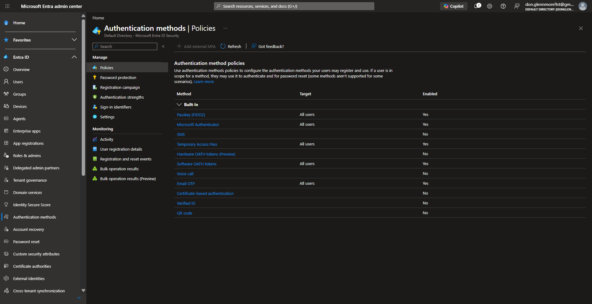
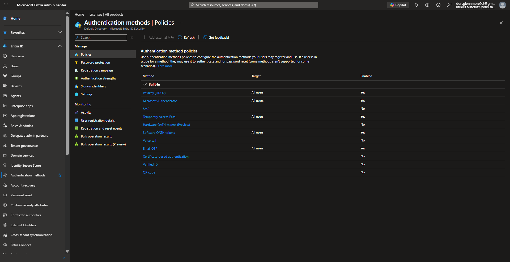
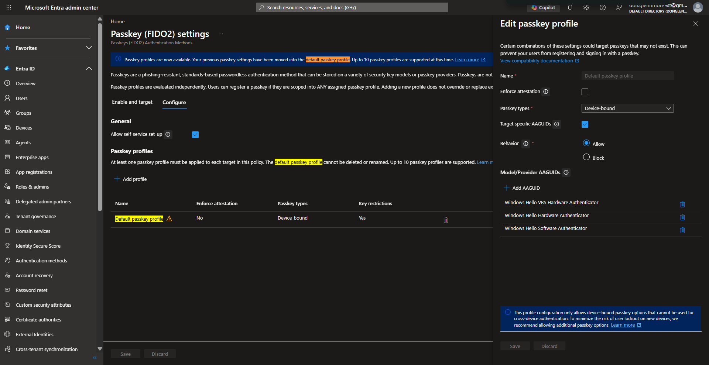
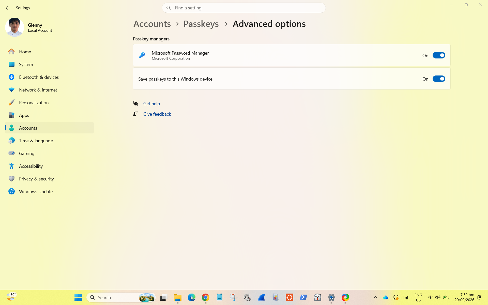
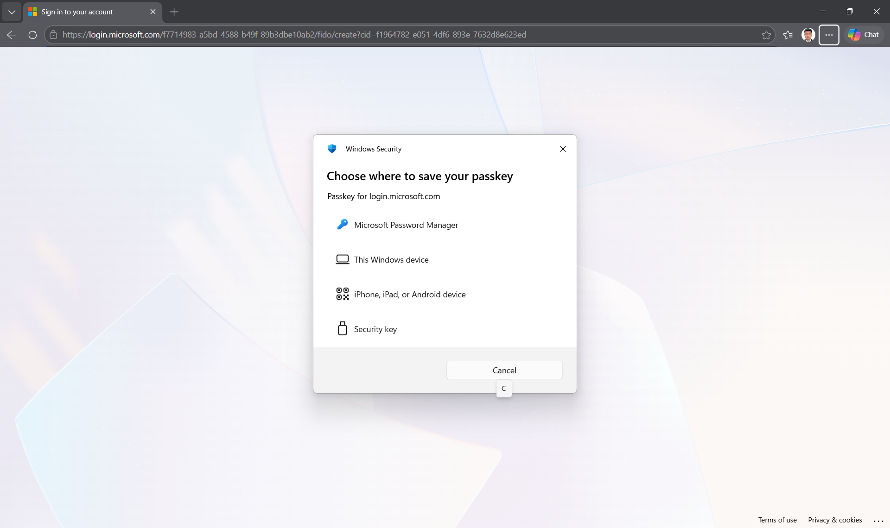
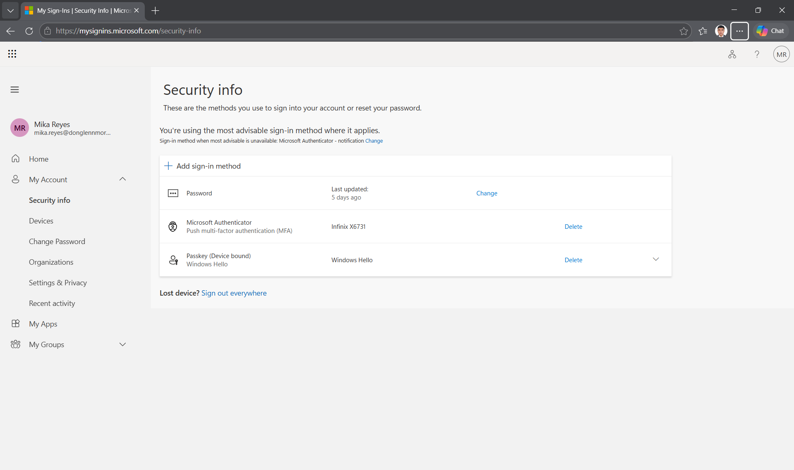
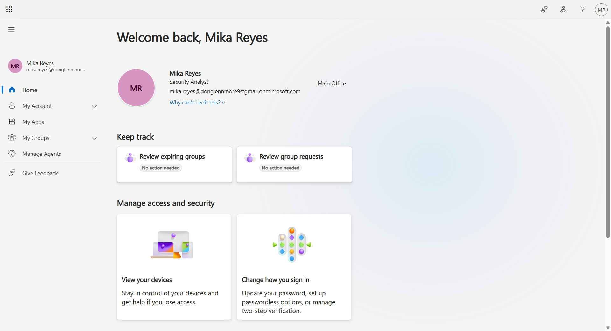
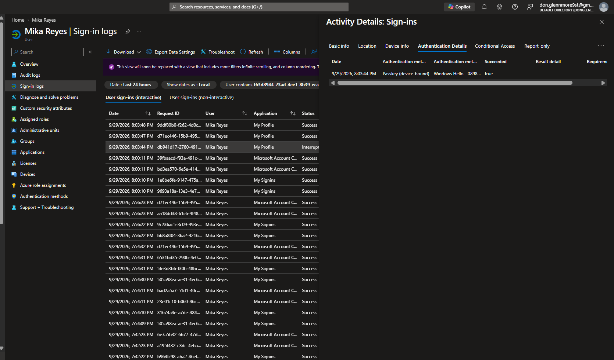

# Evidence Walkthrough

## 1. Authentication Methods Policy Baseline

The lab began by reviewing the tenant's existing **Microsoft Entra authentication method policies**.

This established the starting configuration and confirmed which authentication methods were currently available to users, including **Passkey (FIDO2)**, Microsoft Authenticator, Temporary Access Pass, Software OATH, and Email OTP.

This baseline helped separate the tenant-wide authentication policy from the more specific passkey configuration that would be tested later.

---

## 2. Passkey (FIDO2) Enabled

The **Passkey (FIDO2)** authentication method was verified as enabled in Microsoft Entra ID.

This policy determines whether users in scope are permitted to register and use FIDO2/passkey credentials for authentication.

At this stage, the goal was to confirm that the tenant allowed passkey authentication before applying more specific authenticator restrictions.

---

## 3. Device-Bound Windows Hello Policy Verified

The passkey profile was configured for **Device-bound** passkeys.

Authenticator restrictions were also enabled using specific **AAGUIDs (Authenticator Attestation GUIDs)** associated with Windows Hello authenticator models.

The profile showed:

- Passkey type: **Device-bound**
- Target specific AAGUIDs: **Enabled**
- Behavior: **Allow**
- Windows Hello authenticator models included

This reduced the allowed passkey path to the Windows Hello authenticator family used in this lab.

---

## 4. Local Windows Passkey Saving Enabled

During testing, Windows offered Microsoft Password Manager as a passkey storage destination.

To test a truly device-bound Windows Hello credential, the endpoint configuration was reviewed under:

**Windows Settings → Accounts → Passkeys → Advanced options**

The option **Save passkeys to this Windows device** was enabled.

This allowed Windows itself to become an available local destination for the credential.

---

## 5. This Windows Device Passkey Option Available

After enabling local passkey storage, the Windows Security registration dialog displayed **This Windows device** as a selectable passkey destination.

The available choices included Microsoft Password Manager, another mobile device, a security key, and the local Windows device.

The appearance of **This Windows device** confirmed that the endpoint was now capable of receiving the device-bound credential required for the lab.

---

## 6. Device-Bound Windows Hello Passkey Registered

The passkey was then registered using the local Windows device.

The user's Microsoft Security Info page showed:

**Passkey (Device bound)**  
**Windows Hello**

This provided user-side evidence that the credential was successfully registered as a Windows Hello device-bound passkey instead of a synced passkey provider credential.

---

## 7. Passwordless Sign-In Successful

A fresh sign-in session was used to test the newly registered credential.

Windows Security recognized the passkey and requested local Windows Hello verification. After successful verification, the user reached the Microsoft account portal without entering the Microsoft Entra account password during the passkey authentication step.

The successful arrival at the user's account confirmed that the passwordless authentication flow completed successfully.

---

## 8. Backend Authentication Verification

The final validation was performed from the administrator side using **Microsoft Entra sign-in logs**.

Under **Authentication Details**, the sign-in record showed:

- Authentication method: **Passkey (device-bound)**
- Authentication method detail: **Windows Hello**
- Succeeded: **true**

This was the strongest backend evidence in the lab because it confirmed that Microsoft Entra recognized the successful authentication as a device-bound Windows Hello passkey event.

---

## End-to-End Validation

The completed authentication path was:

**Microsoft Entra policy**
→ **Device-bound passkey restriction**
→ **Windows endpoint preparation**
→ **Windows Hello passkey registration**
→ **Passwordless sign-in**
→ **Microsoft Entra backend verification**

The lab demonstrated an important IAM validation principle:

> **Configuration alone is not enough. Verify the policy, credential registration, user authentication experience, and backend authentication record end-to-end.**
